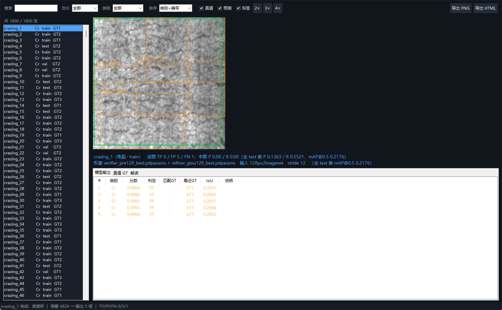

# 钢材表面缺陷检测 · 交互式演示程序（成员 C · 任务2）

任选 NEU-CLS 数据集里的一张图片，直接查看**最终交付流程**（滑窗 + 区域验证器 + 区域精修器融合）
的检测结果：图上叠加真值框与预测框，旁边列出逐框分数、匹配情况与全库指标对照。



本目录与程序其它部分放在一起（仓库内 `demo/`），只需这一个文件夹就能演示。

---

## 一、目录内容

| 文件 | 说明 |
|---|---|
| `demo_fused.py` | 演示程序本体（图形界面 + 命令行双模式）|
| `run_gui.bat` | **双击启动图形界面**（跨机器：只要能找到任意 Python 即可）|
| `view_one_image.bat` | 双击后输入图片名，命令行出结果并导出 PNG/HTML |
| `launch.py` | 启动器：自动寻找**装了 paddle 的 Python**，再用它启动演示程序 |
| `check_env.py` | **换电脑后先跑这个**：逐项检查 Python/依赖/GPU/数据/权重/模块，给出能不能跑的结论 |
| `screenshot_gui.png` | 图形界面截图（本文件顶部那张）|
| `export/` | 导出目录（HTML 报告、三联图 PNG），已加 .gitignore 不进版本库 |

---

## 二、怎么启动

**方式 A：双击（推荐）**

```
demo\run_gui.bat
```

**方式 B：命令行**（仓库根目录执行）

```bat
python demo\launch.py                          :: 图形界面（自动找带 paddle 的解释器）
python demo\launch.py --list --limit 20        :: 列出图片清单
python demo\launch.py --image crazing_10       :: 看指定的一张
python demo\check_env.py                       :: 环境自检（换电脑后先跑这个）

:: 如果你已经知道哪个解释器装了 paddle，也可以直接用它
C:\Users\htt22\miniconda3\envs\paddle_env\python.exe demo\demo_fused.py --gui
```

> 首次打开会加载权重（1~3 秒），每张图首次推理约 4~6 秒（GPU），之后走缓存瞬时切换。
> 没有 GPU 也能跑（自动降级 CPU），但**每张图约 68 秒**（本机实测），见第七节。

---

## 三、图形界面操作

```
┌─ 工具栏 ────────────────────────────────────────────────────────────────────┐
│ 搜索[__] 划分[全部▾] 类别[全部▾] 排序[类别+编号▾] ☑真值 ☑预测 ☑标签 2×3×4× 导出HTML 导出PNG │
├──────────┬──────────────────────────────────────────────────────────────────┤
│ 图片清单  │  图像（绿=真值　红实线=命中TP　橙虚线=误检FP）                       │
│ 1800 张  │  一句话结论 + 权重/参数信息                                       │
│ 可搜索筛选│  [模型输出] [真值 GT] [解读]                                      │
├──────────┴──────────────────────────────────────────────────────────────────┤
│ 状态栏：耗时 ｜ 滑窗数 → 输出框数 ｜ 该图 TP/FP/FN                            │
└─────────────────────────────────────────────────────────────────────────────┘
```

- **搜索**：`crazing`、`划痕`、`Sc`、`crazing_10` 都能筛（回车生效）
- **划分 / 类别**：train / val / test 与 6 个类别
- **排序**：
  - `类别+编号`（默认）：Cr→In→Pa→PS→RS→Sc 分组，组内按编号**数值大小**（`crazing_2` 在 `crazing_10` 前）
  - `文件名`：纯字典序；`划分`：train→val→test；`GT框数↓`：标注框多的排前面
- **复选框**：真值框 / 预测框 / 框上标签 可开关
- **2× 3× 4×**：放大图像（龟裂、划痕这类细纹理建议 3× 以上）
- **导出 HTML**：单文件网页报告（图片内联、可发给别人）；**导出 PNG**：三联图（可直接进 PPT）
- 点击左侧列表即开始计算，推理在后台线程，界面不会卡

**图上颜色**：🟩 绿=真值 GT；🟥 红实线=命中 TP（IoU≥0.5）；🟧 橙虚线=误检 FP；
文字为 `#序号 类别 分数 判定` / `GT序号 类别`。

---

## 四、用的是哪套参数（与交付评估一致）

```
200×200 图
  ├─ 多尺度多宽高比滑窗：4 尺度 × 4 宽高比，步长 12 → 4624 个候选窗
  ├─ 精修器 RegionRefiner（128px / imagenet）→ 类别概率 + 精修框
  ├─ 验证器 DefectVerifier（128px / imagenet）→ 类别概率
  ├─ 几何平均融合：cls = √(pv·pr)，P(缺陷) = √((1-pv_bg)(1-pr_bg))
  └─ 分数阈值 0.6 → 截 top-150 → NMS(IoU 0.4) → 每图最多 50 框
```

- 权重：`results/weights/verifier_pre128_best.pdparams` + `refiner_giou128_best.pdparams`（19.8 MB）
- 全 test 集参考：**mAP@0.5 = 0.2176**（P 0.1363 / R 0.5521）；val 0.2473
- 判定口径与 mAP 计算一致（`eval_det.match_stats`）：按分数降序、同类、IoU≥0.5、真值不重复占用

覆盖参数：`--stride 16 --score-th 0.5` 等（`python demo\demo_fused.py -h`）。

---

## 五、常见问题

| 现象 | 处理 |
|---|---|
| 双击闪退 | 仓库被移动/改名也没关系：两个 .bat 都按自身位置（`%~dp0`）找程序，无需改路径；确认新位置下 `demo/` 与 `src/`、`dataset/`、`results/weights/` 齐全即可 |
| 提示找不到权重 | 确认 `results/weights/` 下两个 pre128/giou128 权重存在 |
| 想重新算 | 加 `--no-cache`（既不读也不写缓存），或删除 `%TEMP%\neu_det_demo_cache` |
| 想更快 | `--stride 16`（快约 1.7 倍，指标略降）|
| 无 GPU | 加 `--device cpu`（明显变慢）|

---

## 六、演示想说明什么

单阶段检测器（YOLOv3 / PP-YOLOE-s）在本数据集上**失败**了（正样本仅占 0.3%，置信度学不出来，
val mAP ≈ 0.0000~0.0007）。最终方案改为 **「无参数滑窗定位 + 轻量判别模型判类/修框 + 概率融合」**，
把问题从"学一个置信度"变成"对每个候选窗判一次类"，测试集 mAP 从 0.0548 提到 0.2176。

所以界面上常见的现象是：**类别基本都判对，但框时准时偏、一个真值被多个框认领**
（大面积龟裂、细长划痕这类边界弥散的缺陷尤其明显）——这正是当前方案的已知短板，
也是报告里"召回尚可、精度偏低"的可视化体现。

---

## 七、换到另一台电脑能不能跑（打包与自检）

**程序本身可移植**：代码里没有写死的机器路径（项目根目录按文件位置推导），
`launch.py` 会自动寻找装了 paddle 的解释器。要跑起来需要四样东西齐全：

| 必需项 | 说明 | 完整程序包里 |
|---|---|---|
| ① 代码 | 整个仓库（`demo/` + `src/det/` 等）| ✅ 有 |
| ② 数据集 | `dataset/det/JPEGImages`(1800) + `Annotations`(1800) + `ImageSets/Main` | ✅ 有 |
| ③ 权重 | `results/weights/verifier_pre128_best.pdparams` + `refiner_giou128_best.pdparams`（各 10 MB）| ✅ 有 |
| ④ 环境 | Python 3.10~3.12 + `paddlepaddle(-gpu)` + `numpy` `pillow` `matplotlib` `pyyaml` | ❌ 需在新机器上装 |

### 到新机器后的三步

```bat
:: 1) 自检：逐项告诉你缺什么（Python 版本 / 依赖 / GPU / 数据 / 权重 / 代码模块）
python demo\check_env.py

:: 2) 若自检全绿，直接演示
demo\run_gui.bat

:: 3) 若自检说「没找到装了 paddle 的 Python」，把 DEMO_PY 指到你自己的解释器
set DEMO_PY=D:\你的环境\python.exe
python demo\launch.py
```

### 速度预期（本机实测，同一张图 CPU/GPU 结果一致）

| 设备 | 每张图 | 说明 |
|---|---|---|
| NVIDIA GPU（RTX 5070 Ti Laptop）| **4.7 秒** | 正常演示体验 |
| 纯 CPU | **68.3 秒** | 慢约 14.5 倍；建议加 `--stride 16`（约快 1.7 倍）或只抽查几张图 |

- GPU 需要装 `paddlepaddle-gpu` 且驱动匹配；**装不上 GPU 也能用 CPU 版 `paddlepaddle` 跑**
- 换显卡型号不影响结果（同一输入，CPU / GPU 输出一致——本机已对比验证）
- 首次运行会在 `%TEMP%\neu_det_demo_cache` 建缓存，不写进仓库

### 可能踩的坑

| 现象 | 原因 | 处理 |
|---|---|---|
| 双击 bat 提示 `Python not found` | 新机器没把 Python 加进 PATH | 重装 Python 时勾选 "Add to PATH"，或先 `set DEMO_PY=...` 再双击 |
| 报 `No module named 'paddle'` | 用了一个没装 paddle 的解释器 | 用 `demo\launch.py` 启动（它会自动挑带 paddle 的），或 `set DEMO_PY=` |
| 报缺 `dataset/det/label_list.txt` | 只拷了 `demo/`，没拷数据 | 用完整程序包（含 `dataset/`）|
| 报找不到权重 | `results/weights/` 少了两个 pre128/giou128 权重 | 从完整包里补齐（各 10 MB）|
| 界面能开但点图很慢 | 在 CPU 上跑 | 属正常，见上表；可用 `--stride 16` 提速 |
